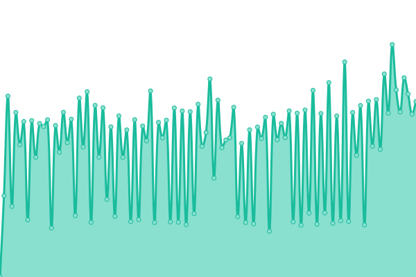

# [📈 Live Status](https://big-digital.github.io/BIG_Upptime): <!--live status--> **🟧 Partial outage**

This repository contains the open-source uptime monitor and status page for [Big Digital](https://bigdigital.ca), powered by [Upptime](https://github.com/upptime/upptime).

With [Upptime](https://upptime.js.org), you can get your own unlimited and free uptime monitor and status page, powered entirely by a GitHub repository. We use [Issues](https://github.com/big-digital/BIG_Upptime/issues) as incident reports, [Actions](https://github.com/big-digital/BIG_Upptime/actions) as uptime monitors, and [Pages](https://big-digital.github.io/BIG_Upptime) for the status page.

<!--start: status pages-->
<!-- This summary is generated by Upptime (https://github.com/upptime/upptime) -->
<!-- Do not edit this manually, your changes will be overwritten -->
<!-- prettier-ignore -->
| URL | Status | History | Response Time | Uptime |
| --- | ------ | ------- | ------------- | ------ |
|  [Big Digital Website](https://bigdigital.ca) | 🟩 Up | [big-digital-website.yml](https://github.com/Big-Digital/BIG_Upptime/commits/HEAD/history/big-digital-website.yml) | 

 1239ms
     
 | 

<a href="https://big-digital.github.io/BIG_Upptime/history/big-digital-website">100.00%</a>
    

|  [Event Sector API](https://demo.bigdigital.ca/collections) | 🟥 Down | [event-sector-api.yml](https://github.com/Big-Digital/BIG_Upptime/commits/HEAD/history/event-sector-api.yml) | 

 162ms
     
 | 

<a href="https://big-digital.github.io/BIG_Upptime/history/event-sector-api">0.00%</a>
    

|  [Event Sector App](https://staging.demo.bigdigital.ca/real-time-emergency-messaging) | 🟥 Down | [event-sector-app.yml](https://github.com/Big-Digital/BIG_Upptime/commits/HEAD/history/event-sector-app.yml) | 

 0ms
     
 | 

<a href="https://big-digital.github.io/BIG_Upptime/history/event-sector-app">100.00%</a>
    

|  [Home Hardware API](https://homehardware.bigdigital.ca/collections) | 🟩 Up | [home-hardware-api.yml](https://github.com/Big-Digital/BIG_Upptime/commits/HEAD/history/home-hardware-api.yml) | 

 155ms
     
 | 

<a href="https://big-digital.github.io/BIG_Upptime/history/home-hardware-api">100.00%</a>
    

|  [Home Hardware App](https://app.homehardware.bigdigital.ca/content) | 🟩 Up | [home-hardware-app.yml](https://github.com/Big-Digital/BIG_Upptime/commits/HEAD/history/home-hardware-app.yml) | 

 161ms
     
 | 

<a href="https://big-digital.github.io/BIG_Upptime/history/home-hardware-app">100.00%</a>
    

|  [Kia Bessada API](https://kia-bessada.bigdigital.ca/collections) | 🟩 Up | [kia-bessada-api.yml](https://github.com/Big-Digital/BIG_Upptime/commits/HEAD/history/kia-bessada-api.yml) | 

 153ms
     
 | 

<a href="https://big-digital.github.io/BIG_Upptime/history/kia-bessada-api">100.00%</a>
    

|  [Kia Bessada App](https://app.kia-bessada.bigdigital.ca) | 🟩 Up | [kia-bessada-app.yml](https://github.com/Big-Digital/BIG_Upptime/commits/HEAD/history/kia-bessada-app.yml) | 

 144ms
     
 | 

<a href="https://big-digital.github.io/BIG_Upptime/history/kia-bessada-app">100.00%</a>
    

|  [Campus Suites API](https://campus-suite.greenfeeds.ca/collections) | 🟥 Down | [campus-suites-api.yml](https://github.com/Big-Digital/BIG_Upptime/commits/HEAD/history/campus-suites-api.yml) | 

 0ms
     
 | 

<a href="https://big-digital.github.io/BIG_Upptime/history/campus-suites-api">0.00%</a>
    

<!--end: status pages-->

[**Visit our status website →**](https://big-digital.github.io/BIG_Upptime)

## 📄 License

- Powered by: [Upptime](https://github.com/upptime/upptime)
- Code: [MIT](./LICENSE) © [Big Digital](https://bigdigital.ca)
- Data in the `./history` directory: [Open Database License](https://opendatacommons.org/licenses/odbl/1-0/)
